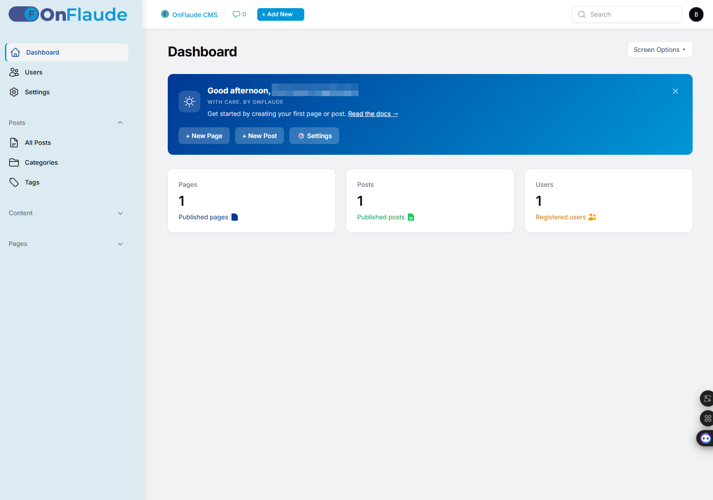
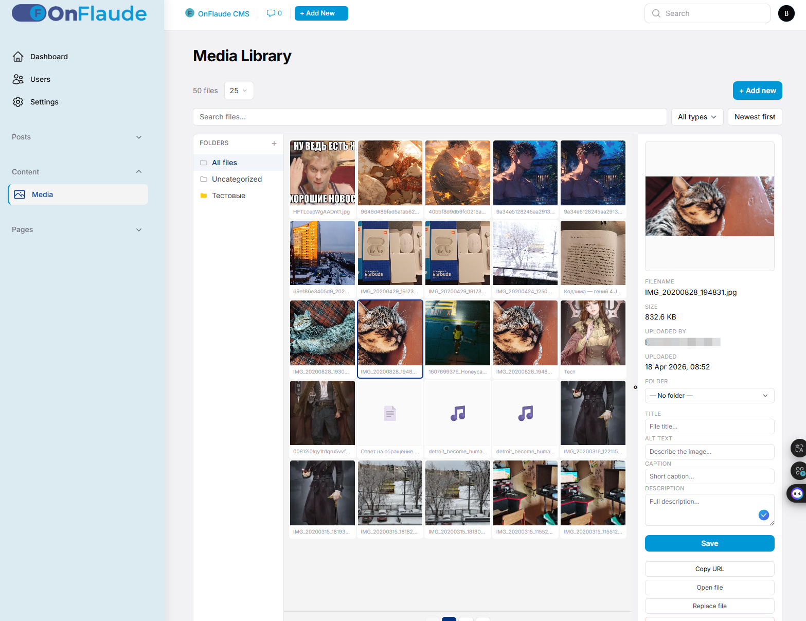

# OnFlaude

> A modern self-hostable web platform: CMS · themes · plugins · Python services.
> Built on Laravel 12 + Filament 3 + PostgreSQL.


> ⚠️ **Pre-alpha.** Active development, not production-ready.
> No stable release yet. First public milestone planned as **v1.0.0**.

---

## The pitch

OnFlaude is a self-hostable web platform that treats a CMS, a theme library,
a plugin system, and Python-based automation services as **first-class citizens
of a single installation**.

You install OnFlaude once — and from one admin panel you can:

- Run your content site (pages, posts, media, SEO)
- Install and switch themes, create child-themes
- Install plugins that extend the admin and the public site
- Launch and monitor Python services — Telegram bots, n8n workflows, parsers, AI agents — without jumping to a separate server

**Built-in, not bolted on:**

- **Security first** — no legacy surface area, custom admin path, hardened session handling
- **Own theme & plugin library** — each theme/plugin is a self-contained module with manifest metadata
- **Python as a peer** — the platform knows how to install, start, stop, and talk to Python services via a standard `service.json` contract

> This is the vision. The README below separates what already works, what is in progress, and what is planned.

---

## Why OnFlaude

The problem with the current landscape:

- **Legacy CMSs** carry years of compromise in their security model
- **Modern Laravel CMSs** stop at content — they don't help you run a Telegram bot alongside your site
- **Flat-file CMSs** sacrifice structured content for simplicity

OnFlaude aims for a different point on the map: a strict modern core with a first-class extension story for both PHP plugins and Python services.

---

## Current status

```
Core & DB        [█████████████████░░░]  85%
Admin UI         [████████████░░░░░░░░]  60%
Media library    [████████████░░░░░░░░]  60%
Theme system     [████████░░░░░░░░░░░░]  40%
Plugin system    [█░░░░░░░░░░░░░░░░░░░]   5%
Python services  [░░░░░░░░░░░░░░░░░░░░]   0%
Documentation    [░░░░░░░░░░░░░░░░░░░░]   0%
Localization     [░░░░░░░░░░░░░░░░░░░░]   0%
```

Overall: ~55% toward v1.0.0.

---

## Stack

| Layer | Technology |
|---|---|
| Backend | PHP 8.3, Laravel 12 |
| Admin panel | Filament 3.3 (Livewire v3, Alpine.js) |
| Database | PostgreSQL 16 |
| Frontend build | Vite 7, PostCSS, Tailwind CSS v3 |
| Editor | TipTap (via `awcodes/filament-tiptap-editor`) |
| Image processing | Intervention Image + Imagick |
| Testing | Pest |
| Web server | Nginx 1.24 |
| OS (reference) | Ubuntu 24.04 LTS |

Optional (for plugins that ship Python services):

- Python 3.10+, pip, venv
- systemd (for managed auto-restart)

---

## What works today

### ✅ Core
- Custom admin URL path (stored in DB `options`, not hardcoded)
- `config/onflaude.php` — platform settings (paths, active theme, locale)
- View namespaces: `theme::` for the public site, `admin::` for the admin panel
- Full ITCSS CSS architecture for both theme and admin panel
- Hybrid Vite build: `vite.config.js` (theme) + `vite.filament.config.js` (admin)

### ✅ Database & content
- `options` table — global site settings (WordPress-like `wp_options` analog)
- Pages, Posts, Categories, Tags, Media, MediaFolders, Users
- Users with roles (admin/editor/author) and per-user time preferences

### ✅ Admin panel (Filament)
- Custom branding (logo, favicon, color scheme)
- Dashboard with WelcomeBanner (time-of-day greeting) and Screen Options panel
- Collapsible sidebar with accordion (single-open groups)
- Custom top bar: site favicon, Add New dropdown, global search
- Full-width content layout
- Settings page (UI over `options` table)

### ✅ Post editor
- TipTap rich editor with full toolbar
- 2+1 layout: main column + collapsible right sidebar (metadata, categories, tags, featured image)
- Featured image via MediaPicker with instant preview
- Builder blocks: heading, text, image, code, quote

### ✅ Media library
- Own core — no third-party media packages
- Folders, thumbnails (400×400 auto-generated), renamable files
- MIME validation through `finfo`
- Files served through `MediaController`, not public disk exposure

### ✅ Frontend & theme system
- `themes/default/` — flat theme structure (no `resources/` wrapper)
- `theme.json` manifest (name, slug, version, author, requires, supports, screenshot)
- Routing for pages, posts, categories, tags + catch-all slug
- ITCSS CSS layers (settings / base / layout / components / pages / utilities)

### ✅ Platform-level admin bar
- `resources/admin-bar/` — CSS + JS + Blade, injected by `InjectAdminBar` middleware
- Any theme automatically gets the admin bar without `@include` or CSS import
- Positioning via `body:has(.of-admin-bar)` — themes stay admin-bar-agnostic

### ✅ Security & infrastructure
- Recovery endpoint authenticated via APP_KEY prefix
- Daily PostgreSQL backups (cron, 7-day rotation)
- Pest test suite (~13 baseline tests)

---

## In development

- Theme installer (ZIP upload → `themes/`)
- Theme Library UI (browse, preview, activate themes)
- Child-theme support (WordPress-style `{name}-child` convention)
- Drag-to-resize dashboard widgets
- MediaPicker modal migration from Filament Action to Alpine-driven modal (resolves a Livewire wire-cycle conflict)
- Populating empty ITCSS layers of the default theme with real styles
- Mobile adaptation (< 1024px)

---

## Planned

### Plugin system
- `plugin.json` manifest with versioning and compatibility declarations
- Plugin installer (ZIP upload → `plugins/`)
- First killer plugin: **Visual Builder** (drag-and-drop block editor for pages)
- Additional planned: `n8n-connector`, `telegram-admin`, `vpn-manager`

### Python services (flagship feature)
- Standard `service.json` contract (entrypoint, requirements, systemd config, API endpoints)
- `app/Services/ServiceManager.php` — start/stop/restart/status
- `app/Services/ServiceInstaller.php` — `python -m venv`, `pip install`, systemd unit setup
- `app/Services/ServiceRegistry.php` — scan `services/` and `plugins/*/service/`
- Filament Services page: status, logs in real-time, Start/Stop/Restart buttons
- First ported services: `hh-parser` (HH.ru vacancies), `freelance-bot` (multi-platform AI parser)

### Security
- Two-factor authentication via email code (own implementation, no third-party packages)
- Audit log for admin actions
- Honeypot on the login form

### Admin UX
- Icons on collapsed sidebar with tooltips
- Drag-and-drop widget reordering on Dashboard
- Dark/Light theme switch per user
- Interface scale setting
- "For Developers" landing page in admin

---

## Screenshots

> The dev instance is not publicly accessible yet — screenshots are the current way to see OnFlaude in action. These are captured from the active development branch.

### Admin — Dashboard


### Admin — Post editor


### Admin — Media Library


### Admin — Settings


### Frontend — Default theme


> More screenshots in [`docs/screenshots/`](docs/screenshots/).

---

## Architecture

A simplified view of the repo layout:

```
repo/
├── app/
│   ├── Filament/           Admin panel (Resources, Pages, Widgets)
│   ├── Http/Middleware/
│   │   └── InjectAdminBar.php    Platform-level admin bar injection
│   ├── Livewire/           Livewire components (MediaPicker)
│   ├── Models/             Eloquent models
│   └── Providers/          AppServiceProvider, AdminPanelProvider
│
├── config/
│   └── onflaude.php        Platform settings (paths, theme, locale)
│
├── resources/
│   ├── admin/              Admin panel sources (ITCSS: CSS/JS + Blade)
│   │   ├── css/            theme.css + settings/base/layout/components/pages/utilities
│   │   ├── js/             index.js + components/
│   │   └── views/          Blade, namespace: admin::
│   ├── admin-bar/          Platform-level admin bar (injected by middleware)
│   └── views/              System Blade (recovery, welcome)
│
├── themes/                 All themes live here
│   └── default/            Bundled default theme
│       ├── theme.json      Theme manifest
│       ├── assets/         Static (logo, favicon)
│       ├── css/            ITCSS layers
│       ├── js/             Entry + bootstrap
│       └── views/          Blade, namespace: theme::
│
├── plugins/                (empty — coming)
├── services/               (for platform-level Python services)
├── storage/app/media/      Media storage
└── public/build/           Vite output
```

**Key design decisions:**

- **Flat theme structure** — themes are self-contained modules without a `resources/` wrapper. Drop a folder in `themes/` and it's installable.
- **Two Vite configs** — `vite.config.js` for the theme, `vite.filament.config.js` for the admin panel. Not unified intentionally, for isolation and Filament 3 compatibility.
- **Platform-level admin bar** — lives in `resources/admin-bar/`, injected via middleware. Any theme gets it automatically.
- **View namespaces everywhere** — `theme::pages.blog`, `admin::pages.dashboard`. No `frontend.*` or `filament.*` references in the code.

---

## Installation

### Requirements

- PHP 8.3+ with extensions: `pdo_pgsql`, `gd` or `imagick`, `fileinfo`, `mbstring`
- PostgreSQL 16+
- Node.js 20+ (build only, can be on a dev machine)
- Composer 2+
- Nginx or Apache

### Steps

```bash
git clone https://github.com/Magbusjap/onflaude.git
cd onflaude

composer install
npm ci                    # IMPORTANT: ci, not install — see note below
npm run build:all         # builds theme + admin in parallel

cp .env.example .env
php artisan key:generate

# Configure DB_* variables in .env, then:
php artisan migrate
php artisan storage:link
```

### ⚠️ About `npm ci` vs `npm install`

The exact Tailwind CSS version (`tailwindcss@3.4.19`) is pinned **only in `package-lock.json`**, not in `package.json`. Running `npm install` may pull the wrong major version and break the theme build.

Always use `npm ci` for a clean install.

If the lock file gets lost:

```bash
git checkout master -- package-lock.json
rm -rf node_modules
npm ci
```

### ⚠️ Build order matters

`npm run build` (theme) clears `public/build/` entirely — default Vite behavior. Running `npm run build:filament` before `npm run build` means the admin CSS gets wiped out.

Always in this order:

```bash
npm run build && npm run build:filament
```

Or use the combined script:

```bash
npm run build:all
```

---

## Development

### Dev server (hot reload)

```bash
npm run dev                # theme
npm run dev:filament       # admin (separate terminal)
```

### Tests

```bash
php artisan test
```

### Admin path

The admin URL is stored in the DB (`options` table, key `admin_path`), not hardcoded. Change via the Settings page or directly in the DB.

### Active theme

Set in `options.active_theme` or overridden via `ONFLAUDE_THEME` env variable.

---

## Roadmap to v1.0

- **v0.2** — Plugin system foundation (installer, manifest, first plugin `visual-builder`)
- **v0.3** — Python services (ServiceManager, Installer, Registry, Services page)
- **v0.4** — Security hardening (2FA, audit log, honeypot)
- **v0.5** — Theme Library UI, child-themes, 404 page, mobile adaptation
- **v0.6** — Documentation (User Docs + Developer Docs), English + Russian
- **v1.0** — First stable release: full plugin/theme API, Python service contract, production-ready

Progress is tracked as branches and pull requests. See [issues](https://github.com/Magbusjap/onflaude/issues).

---

## Contributing

OnFlaude is currently in pre-alpha — the author is building the foundation as a solo project. External pull requests are **not accepted yet** to keep the architecture coherent during early design.

**What you can do now:**

- ⭐ **Star the repo** if the direction resonates with you
- 👀 **Watch** to follow the progress
- 💬 **Open issues** — bugs, ideas, architectural questions are welcome
- 💭 **Discussions** — share feedback on the pitch and roadmap

Once v0.5 is out and the plugin/theme contracts stabilize, contributing guidelines will be published and PRs will open.

---

## Author

**Mikhail Ankudinov** (Mikhail Bozheslav)
Laravel & DevOps developer · Perm, Russia

- Portfolio: [bozheslav.ru](https://bozheslav.ru)
- GitHub: [@Magbusjap](https://github.com/Magbusjap)

---

## License

[MIT](LICENSE) — do what you want, keep the copyright.

---

<sub>OnFlaude · v0.1.0-dev · Built with Laravel, Filament, and a lot of ITCSS.</sub>
